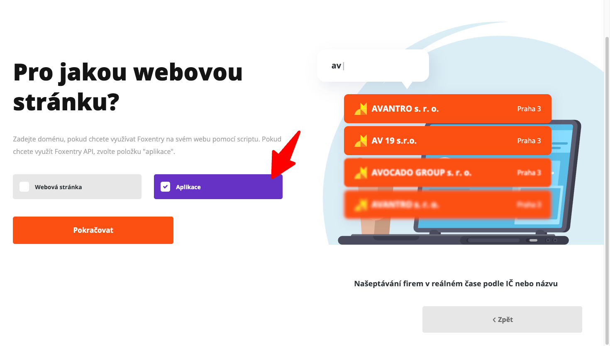
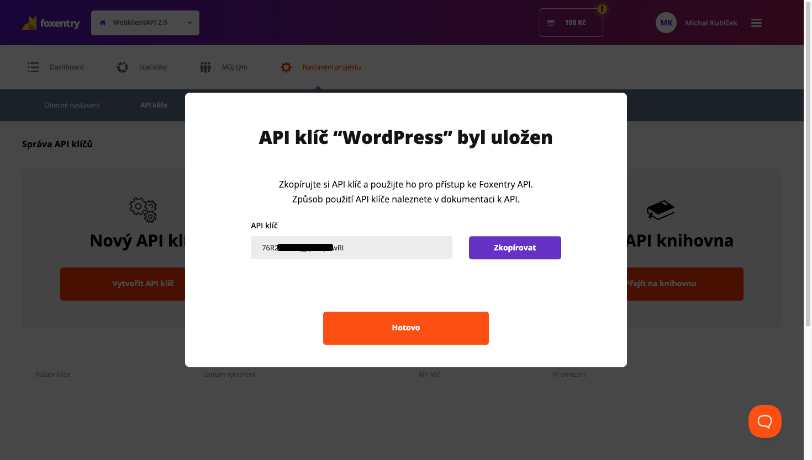
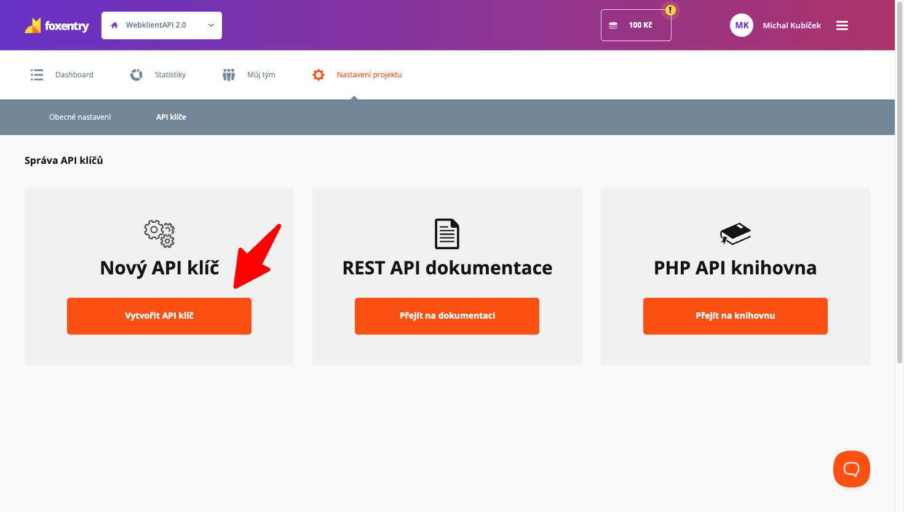

# 🚀 Foxentry Integration WordPress Plugin

[](https://wordpress.org/)
[](https://php.net/)
[](https://www.gnu.org/licenses/gpl-2.0.html)
[](https://github.com/webklient/foxentry-integration)
[](https://foxentry.com/?aff=or8eaq)

> **Moderní WordPress plugin pro Foxentry API** - Kompletní integrace s Foxentry REST API 2.0 pro pokročilou validaci emailů, telefonů a adres s automatickými opravami a návrhy.

## ✨ Hlavní funkce

- 🚀 **REST API 2.0** - Přímá integrace s Foxentry API pro maximální spolehlivost
- ⚡ **Real-time validace** - Okamžitá validace dat během psaní s debounce (800ms)
- 📧 **Podpora více typů** - Email, telefon, adresa s pokročilou validací
- 🔧 **Automatické opravy** - API automaticky opravuje chyby v datech
- 💡 **Inteligentní návrhy** - Nabízí alternativy pro neplatné údaje
- 🎨 **Moderní UI** - Responzivní design s loading indikátory a animacemi
- 🔒 **Bezpečnost** - WordPress bezpečnostní standardy a nonce validace
- 📱 **Responzivní** - Funguje na všech zařízeních včetně dark mode
- 🌍 **Překladatelný** - Plná podpora pro překlady (čeština/angličtina)
- 🛠️ **Admin kontrola** - Test API klíče přímo v administraci
- 📋 **Vizuální průvodce** - Interaktivní návod k získání API klíče s obrázky
- 💾 **Cache systém** - Nastavitelný cache pro optimalizaci výkonu
- 🎯 **Shortcodes** - Jednoduché vkládání validátorů do obsahu

## 🎯 Shortcodes

### Základní validátory
```html
[foxentry_validator type="email"]     <!-- Validátor emailových adres -->
[foxentry_validator type="phone"]     <!-- Validátor telefonních čísel -->
[foxentry_validator type="address"]   <!-- Validátor fyzických adres -->
```

### Pokročilé možnosti
```html
<!-- Vlastní placeholder a CSS třída -->
[foxentry_validator type="email" placeholder="Zadejte váš email" class="my-validator"]

<!-- Formulář s vlastním submit tlačítkem -->
[foxentry_validator type="email" form_action="/kontakt" submit_text="Odeslat"]

<!-- Nepovinné pole -->
[foxentry_validator type="phone" required="false"]
```


## 📋 Požadavky

- WordPress 5.0+
- PHP 7.0+
- Foxentry API klíč ([získejte zde](https://app.foxentry.com/registration?aff=or8eaq))
- cURL podpora pro PHP

## 🚀 Rychlá instalace

### 1. Instalace pluginu
1. **Stáhněte plugin** z WordPress.org nebo GitHub
2. **Nahrajte** do `/wp-content/plugins/foxentry-integration/`
3. **Aktivujte** plugin v WordPress administraci
4. **Přejděte** do Nastavení > Foxentry

### 2. Získání API klíče
Plugin obsahuje **vizuální průvodce** s obrázky, který vás provede celým procesem:

1. **Zaregistrujte se** na [Foxentry](https://app.foxentry.com/registration?aff=or8eaq)
2. **Vytvořte nový projekt** - klikněte na tlačítko pro vytvoření
3. **⚠️ DŮLEŽITÉ:** Ve třetím kroku vyberte **"Aplikace"** místo "Webová stránka"
4. **Dokončete projekt** a pokračujte do administrace
5. **Přejděte** do Nastavení projektu > API klíče
6. **Klikněte** na "Vytvořit API klíč"
7. **Zadejte název** (např. "WordPress")
8. **Zkopírujte** vygenerovaný API klíč (např. `76R2HarteqgqnY6p6wRI`)

### 3. Konfigurace
1. **Vložte API klíč** do pole v pluginu
2. **Nastavte cache** (výchozí: 3600 sekund)
3. **Otestujte** pomocí tlačítka "Otestovat API klíč"
4. **Použijte shortcodes** ve vašem obsahu

## 📝 Manuální instalace

```bash
# Stáhněte a rozbalte do plugins složky
cd /wp-content/plugins/
git clone https://github.com/webklient/foxentry-integration.git
```

## 🔧 Jak to funguje

1. **Vložíte API klíč** do admin rozhraní
2. **Plugin komunikuje** přímo s Foxentry REST API 2.0
3. **Použijete shortcodes** pro validátory ve vašem obsahu
4. **Real-time validace** probíhá přes AJAX s debounce 800ms
5. **Výsledky se cachují** pro optimalizaci výkonu

## 🛠️ Admin rozhraní

Plugin poskytuje moderní admin rozhraní s:

- 📋 **Vizuální průvodce** - Interaktivní návod s obrázky pro získání API klíče
- 🔍 **Test API klíče** - Ověření platnosti vloženého klíče
- ⚙️ **Nastavení cache** - Konfigurace doby ukládání výsledků (výchozí: 1 hodina)
- 🎨 **Moderní design** - Responzivní rozhraní s animacemi
- 🔄 **Interaktivní prvky** - Možnost skrýt/zobrazit průvodce

## 🎨 Screenshots

### Admin rozhraní s vizuálním průvodcem

*Vizuální průvodce pro získání API klíče*

### Vytvoření API klíče

*Vytvoření a zkopírování API klíče*

### Validátory v akci

*Real-time validace emailových adres*

## ❓ FAQ

### Jak získám Foxentry API klíč?

Plugin obsahuje **vizuální průvodce** s obrázky, který vás provede celým procesem:

1. Zaregistrujte se na [Foxentry](https://app.foxentry.com/registration?aff=or8eaq)
2. Vytvořte nový projekt
3. **⚠️ DŮLEŽITÉ:** Ve třetím kroku vyberte **"Aplikace"** místo "Webová stránka"
4. Přejděte do Nastavení projektu > API klíče
5. Vytvořte nový API klíč a zkopírujte ho

### Je plugin zdarma?

Ano, plugin je 100% zdarma! Potřebujete pouze Foxentry účet pro získání API klíče.

### Funguje se všemi tématy?

Ano, plugin je kompatibilní se všemi WordPress tématy. Používá standardní WordPress hooks a shortcodes.

### Jak ověřím, že API klíč funguje?

V adminu pluginu klikněte na "Otestovat API klíč" - plugin automaticky ověří platnost vašeho klíče.

### Jaké typy validace podporuje?

- **Email** - Validace a oprava emailových adres
- **Telefon** - Validace a formátování telefonních čísel
- **Adresa** - Validace a standardizace fyzických adres

### Jak funguje cache?

Plugin cachuje výsledky validace pro optimalizaci výkonu. Výchozí doba je 1 hodina, ale můžete ji změnit v nastavení.

## 🔧 Pro vývojáře

### WordPress Hooks

```php
// Hooks pro rozšíření
do_action('foxentry_before_validation', $type, $value);
do_action('foxentry_after_validation', $type, $value, $result);

// Filtry
$api_key = apply_filters('foxentry_api_key', $api_key);
$cache_duration = apply_filters('foxentry_cache_duration', $duration);
```

### AJAX Endpoints

```php
// Validace dat
wp_ajax_foxentry_validate
wp_ajax_nopriv_foxentry_validate

// Test API klíče
wp_ajax_foxentry_test_api
```

### Technické detaily

- **API:** Foxentry REST API 2.0 s Bearer autentizací
- **JavaScript:** jQuery s debounce 800ms pro optimalizaci
- **Bezpečnost:** Nonce validace, sanitizace vstupů, ověření oprávnění
- **Cache:** WordPress transients pro ukládání výsledků
- **Responzivita:** CSS Grid a Flexbox s mobile-first přístupem

## 🔒 Ochrana dat

- Plugin **neukládá** žádná osobní data uživatelů
- Validace probíhá přes bezpečné AJAX volání na Foxentry API
- API klíč je uložen v WordPress databázi s šifrováním
- Cache výsledků validace je dočasný (nastavitelný)
- Všechna data jsou zpracovávána podle privacy policy Foxentry
- Plugin respektuje GDPR a WordPress bezpečnostní standardy

## 📞 Podpora

Pro technickou podporu kontaktujte:

- **Webklient** - [www.webklient.cz](https://www.webklient.cz)
- **Email:** info@webklient.cz
- **Foxentry podpora** - [support.foxentry.com](https://support.foxentry.com)

## 🚀 Začněte s Foxentry

- **Registrace:** [app.foxentry.com/registration?aff=or8eaq](https://app.foxentry.com/registration?aff=or8eaq)
- **Dokumentace:** [docs.foxentry.com](https://docs.foxentry.com)
- **API dokumentace:** [api.foxentry.com](https://api.foxentry.com)

## 📄 Licence

Tento plugin je licencován pod GPL v2 nebo novější. Více informací najdete v [LICENSE](LICENSE) souboru.

## 🏢 O autorovi

Plugin vytvořen studiem **Webklient** - [www.webklient.cz](https://www.webklient.cz)  
**Mediatoring.com s.r.o.** - Specializace na moderní webová řešení a WordPress development


---

⭐ **Pokud se vám plugin líbí, dejte nám hvězdičku na GitHubu!** ⭐

[](https://github.com/webklient/foxentry-integration)
[](https://wordpress.org/plugins/foxentry-integration/)
